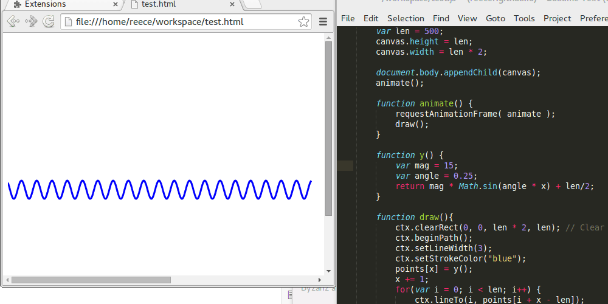
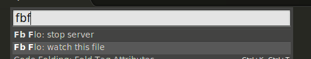

sublime-fb-flo
==============
Sublime plugin for fb-flo.
Runs a server that communicates with fb-flo's chrome extension. Enables live-editing.

##Installation
Search [Package Control](https://sublime.wbond.net/) for "Fb-Flo"

##Commands

- ###Start/Stop server
    Starts/stops the fb-flo server.

    

- ###Watch/Unwatch current file
    Start/stop watching the active file for changes.    

    

##Settings

- ###livereload
    If false, updates will be pushed when files are saved, rather than instantly.
    - default: true

- ###timeout 
    Timeout before broadcasting update (seconds).
    - default: 0.3
